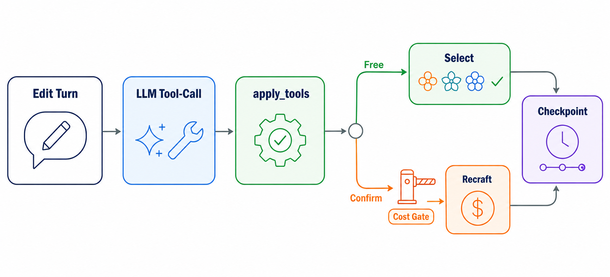
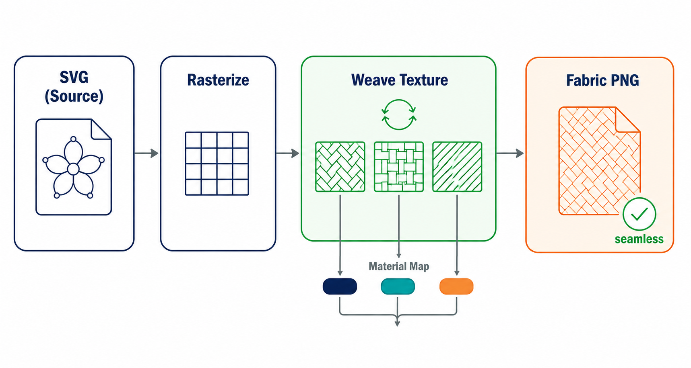

# Seamless Tile

AI 기반 seamless textile SVG 생성 엔진입니다. 자연어 prompt를 고정된 `intent JSON` 계약으로 변환하고,
이후의 좌표, 반복, 배치, 합성, seamless 보장은 deterministic Python engine이 맡습니다. 그 위에 대화로
디자인을 다듬는 세션, 승인 디자인을 "천 느낌" PNG로 만드는 finalize 단계까지 갖추고 있습니다.

## 프로젝트 소개

`seamless-tile`은 LLM이 최종 이미지를 직접 그리는 프로젝트가 아닙니다. LLM은 요구사항을 구조화된
intent로 바꾸는 authoring layer에 머물고, 실제 SVG 생성은 재현 가능한 vector pipeline이 닫습니다.

핵심 질문은 하나입니다.

> 생성형 AI를 어디까지 믿고, 어디서부터 소프트웨어 엔진이 보장할 것인가?

이 프로젝트는 그 경계를 `prompt analysis -> intent JSON -> motif resolution -> deterministic engine`으로
명확히 나눕니다. 대화형 편집(세션)과 원단 texture finalize를 추가한 뒤에도 이 경계는 그대로입니다 —
세션은 authoring 쪽에 붙는 확장일 뿐, 엔진 안으로 LLM 판단이 들어가지 않습니다.

## 전체 아키텍처

위 도식처럼 입력은 prompt 또는 내부 intent JSON입니다. 외부 AI/API는 engine 바깥 adapter boundary에 있고,
engine은 concrete motif ID가 확정된 resolved intent만 입력받습니다.

- **Adapter Boundary**: Gemini(authoring/편집 tool-use), OpenAI embedding, Recraft, reference image seam.
- **Motif Resolver**: 필요한 SVG motif를 기존 pool에서 찾거나 새로 생성.
- **Deterministic Engine**: validation, candidate, placement, composition, seamless 처리.
- **Session Layer**: `session_id` 기반 편집 turn, 비용 게이트, checkpoint 영속, undo/redo/fork.
- **Output Boundary**: SVG source of truth, Supabase preview/log, PNG/TIFF export, 원단 texture finalize.

상세 설계는 [ARCHITECTURE.md](ARCHITECTURE.md)를 기준으로 합니다.

## 1. Prompt -> Intent JSON

Prompt 분석에는 Gemini LLM을 사용합니다. 다만 LLM이 자유롭게 아무 JSON이나 만들게 두지 않고,
프로젝트가 요구하는 고정된 `intent JSON` 형태로 수렴하도록 설계했습니다.

- `gallery/`의 best-practice 예시는 개발자가 직접 검수한 결과물입니다.
- Prompt builder는 이 gallery 구조를 참고해 좋은 패턴 작성 방식을 LLM에 주입합니다.
- 이 단계의 목표는 byte 재현이 아니라 schema 수렴입니다. 채팅 표면에서는 같은 prompt를 다시 보내도
  매번 새로 작성해 다른 디자인을 탐색합니다 — 같은 입력에 바이트 동일 응답을 주지 않습니다. 정확한
  재현은 직접 `intent`를 넣는 경로와 결정론 엔진이 보장합니다(아래 섹션 참고).
- 이 단계의 산출물은 SVG가 아니라 `canvas`, `palette`, `colorways`, `layers`, `placement`를 가진 intent입니다.

즉, LLM은 “그림 생성기”가 아니라 “정해진 schema에 맞춰 textile pattern 의도를 작성하는 parser/author”로
사용합니다.

## 2. Motif SVG 해석과 재사용

Intent가 만들어진 뒤, motif layer에 필요한 SVG를 확정합니다. 이때 매번 Recraft 같은 고비용 생성 API를
호출하지 않도록, Supabase의 vector DB와 OpenAI embedding model로 재사용 가능한 motif를 먼저 찾습니다.

흐름은 다음과 같습니다.

1. LLM이 만든 motif spec을 embedding합니다.
2. Supabase에 저장된 기존 motif record를 facet/filter와 vector similarity로 조회합니다.
3. 설계된 임계치 이상으로 유사한 SVG가 있으면 기존 SVG를 재사용합니다.
4. miss일 때만 Recraft API로 새 SVG motif를 생성하고, normalize 후 다시 저장합니다.

이 구조는 완전한 RAG는 아닙니다. vector DB에서 검색한 데이터를 다시 LLM에 grounding해 답변을 생성하는
형태가 아니기 때문입니다. 대신 **semantic cache + vector reuse**에 가깝습니다. 비용이 큰 motif 생성
호출을 줄이고, 이미 검증된 SVG 자산을 deterministic engine에 다시 투입하려는 것입니다.

재사용/신규생성을 가르는 임계치(τ)는 감으로 정하지 않습니다. 오프라인 라벨셋으로 τ를 스윕해
**틀린 재사용이 0인 최소 τ**를 근거값으로 채택합니다(현재 0.84). 이 하니스는 런타임 엔진 경로나
결정론 계약을 건드리지 않는 별도 스크립트이며, 방법론 상세는 [ARCHITECTURE.md](ARCHITECTURE.md)를
참고하세요.

## 3. Seamless를 보장하는 방식

Seamless는 사후 pixel 보정으로 맞추지 않습니다. 엔진은 처음부터 반복 가능한 좌표계 위에서 SVG를 만듭니다.

- **Angle snap**: 임의 각도를 tile 경계에서 딱 맞물리는 각도로 자동 보정합니다.
- **Torus placement**: motif 위치를 도넛(torus) 좌표계로 계산해 상하좌우 경계가 자연스럽게 이어지게 합니다.
- **Spacing closure**: 곡선을 따라가는 배치 간격은 타일 한 변이 아니라 실제 반복 주기를 기준으로 맞춥니다.
- **Boundary clone**: motif가 경계를 넘으면 반대편에 같은 모티프의 복제본을 추가해 이어붙입니다.

그래서 seamless는 렌더링 후 검사로 억지 보정하는 것이 아닙니다. 수학적으로 닫히는 반복 구조를 먼저 만든 뒤,
raster seam metric은 회귀 가드로만 사용합니다. 아래 4번의 원단 texture finalize도 같은 원칙(wrap 오프셋,
blur 없음)으로 이 보장을 그대로 물려받습니다.

## 4. 대화로 디자인 다듬기 — 세션과 비용 게이트

한 번 만든 디자인을 대화로 다듬는 경로입니다. `POST /generate`에 `session_id`를 붙이면 같은
엔드포인트가 stateless 생성 대신 **편집 turn**이 됩니다.

- 편집은 intent 전체 재작성이 아니라 **닫힌 도구 집합**(색상·배치·밀도·레이어·모티프·seed 등을 바꾸는
  10여 개 도구)에 대한 LLM tool-call 제안 + Python 쪽 결정론 적용입니다. LLM은 "어떤 도구를 어떤
  인자로 부를지"만 제안하고, 인자 검증과 실제 patch는 항상 코드가 합니다. "stripe를 45도로 바꿔줘" 한
  턴이 오면 `stripe.angle`만 바뀌고 나머지 intent는 그대로입니다. 정확한 도구 목록은
  [ARCHITECTURE.md](ARCHITECTURE.md)를 참고하세요.
- **비싼 지출은 항상 확인 뒤에만 일어납니다.** 모티프가 새로 필요하면 기존 pool에서 찾은 무료 후보를
  먼저 제시하고 대화를 일시정지합니다(LangGraph interrupt = checkpoint). 사용자가 기존 후보를 고르면
  비용 없이 바로 적용되고, "새로 생성"을 명시적으로 확인해야만 Recraft가 호출됩니다. **해석과 지출을
  분리**하는 것이 이 경로의 핵심 원칙입니다.
- 세션당 Recraft/finalize 호출 횟수에는 결정론 상한이 있어(초과 시 확인해도 거부), 비용 가드는 LLM
  판단이 아니라 평범한 카운터/락입니다. 같은 세션에 대한 동시 요청은 lock으로 직렬화됩니다.
- 대화 상태는 LangGraph checkpoint로 턴마다 저장됩니다. `SUPABASE_DB_URL`이 있으면 Postgres에, 없으면
  프로세스 메모리에 저장됩니다 — 둘 다 이 레포는 스키마를 만들지 않는 client일 뿐입니다(motif
  persistence와 같은 규칙).
- 각 턴 경계가 체크포인트이므로 이전 턴으로 되감거나(`GET /sessions/{id}?checkpoint_id=`), 그 지점에서
  다른 편집을 시도해 **원래 분기를 건드리지 않고 새 분기(fork)**를 만들 수 있습니다
  (`POST /generate`의 `from_checkpoint`). 존재하지 않는 체크포인트나 다른 세션의 체크포인트를
  가리키면 조용히 새 대화를 시작하는 대신 404를 반환합니다.

## 5. 원단 텍스처로 마감하기 — Finalize

승인한 디자인을 실제 "천" 느낌 PNG로 바꾸는 마지막 단계입니다. 여기도 생성형 모델을 쓰지 않습니다.

- `POST /finalize`는 승인된 후보의 intent를 그대로 재합성한 뒤, 번들로 들고 있는 여러 종류의 tileable
  위브 사진(체크, 헤링본, 자카드 등)을 wrap 방식으로 이음매 없이 겹쳐 합성합니다.
- 원단 종류를 배경/스트라이프/모티프 등 영역(color slot)별로 다르게 지정할 수 있습니다(`material_map`).
  영역 구분은 각 slot을 서로 다른 색으로 칠한 라벨 렌더를 한 번 더 뽑아 마스크로 쓰는 방식이라, 새 엔진
  코드 없이 기존 합성 파이프라인만 재사용합니다. 지정하지 않은 영역은 균일 원단으로 폴백합니다.
- 같은 입력(intent, colorway, weave, material map, 자산 버전)은 byte 동일 PNG를 만들고, 이음매도 blur
  없는 wrap 오프셋으로만 만들기 때문에 3번의 seamless 가드를 그대로 통과합니다.
- 세션에서 대화 중 `set_material`로 지정한 원단은 `confirm{action:"finalize"}` 호출 시 자동으로
  반영됩니다(같은 영역을 요청에서도 지정하면 요청이 이깁니다).

## 내부 엔진 구조

resolved intent가 들어온 뒤 SVG가 나올 때까지는 5단계 결정론 파이프라인(Validation → Candidate →
Placement → Composition → Seamless)이 처리합니다. 세션 편집 turn도 결국 이 파이프라인을 그대로
호출합니다 — LLM 판단이 엔진 안으로 들어오지 않습니다. 각 엔진의 파일 위치와 정확한 책임 경계는
[ARCHITECTURE.md](ARCHITECTURE.md)의 "내부 엔진 책임" 절을 참고하세요.

## 심화 설계 포인트

프로젝트를 더 깊이 이해하고 싶다면 알아두면 좋은 설계 포인트입니다. 정확한 필드명·해시 공식·내부
함수 계약은 [ARCHITECTURE.md](ARCHITECTURE.md)가 최신 기준이니, 여기서는 "왜 이렇게 설계했는지"만
짚습니다.

- **결정론의 단위는 `(prompt, seed)`만이 아닙니다.** reusable motif pool이 커지면 같은 seed라도 고르는
  variant가 달라질 수 있어서, generate 시점의 motif pool 상태까지 재현 단위에 포함시킵니다. 그래서
  "같은 입력이면 같은 SVG" 계약은 prompt 단계가 아니라 **resolved intent → SVG** 구간에서 성립합니다.
  prompt 단위 재현이 필요하면 직접 `intent` 경로를 쓰거나 `GENERATE_CACHE_SIZE`를 켜세요(repro/debug).
- **신뢰할 수 없는 입력은 fail-closed로 처리합니다.** SVG/이미지는 공격 표면이 넓어서, DTD/entity 공격
  차단, output allowlist 검증, 외부 href/`javascript:` URL 거부, 로컬 decode만 허용(SSRF 경로 밖),
  업로드 크기/포맷/픽셀 상한 같은 안전장치를 engine/output 경계에 둡니다.
- **색은 항상 slot을 통해 해석됩니다.** layer는 raw hex를 들고 다니지 않고 color slot ID만 참조하고,
  실제 색은 활성 colorway가 마지막 합성 단계에서 해석합니다. Recraft나 외부 SVG의 multicolor motif도
  이 slot 모델로 정규화한 뒤 붙습니다.
- **다양성도 결정론적으로 만듭니다.** motif variant 선택은 `variant_group + seed`의 순수 함수라, pool
  반환 순서가 달라져도 같은 seed는 같은 variant를 고릅니다.
- 세션 편집(`apply_tools`)도 같은 결정론 계약 안에 있어, 되감기(undo)·분기(fork) 후 재합성도 byte
  동일합니다.

## 시스템·운영 설계

엔진 외곽에서 비용·안정성·재현성을 받치는 설계입니다. 정확한 env var, 상태 코드, 카운터 이름은
[ARCHITECTURE.md](ARCHITECTURE.md)의 "Persistence와 소유권"/"핵심 결정" 절을 참고하세요.

- **응답 캐시(옵트인, 기본 꺼짐)**: 채팅 표면에서는 "같은 입력→바이트 동일"이 기본이면 안 되므로
  기본은 끔. 켜면 직전 candidates/preview URL을 그대로 재사용하는 결정론/repro 디버깅용 opt-in입니다.
- **Resource ceiling**: 단일 intent나 세션이 만들 수 있는 작업/출력(placement 수, SVG 크기, 원단
  Recraft/finalize 호출 횟수)에 상한을 둬 신뢰할 수 없는 입력이 자원을 무한히 끌어쓰지 못하게 합니다.
- **필수 vs 선택 의존성**: LLM(Gemini)·embedding(OpenAI) 키는 앱이 부팅할 때부터 필요한 필수 설정이라
  없으면 부팅 자체가 실패합니다. 반대로 `SUPABASE_DB_URL`(motif/세션 영속)과 Storage 설정은 선택이라
  없으면 in-memory/no-op으로 우아하게 낮아집니다(로컬·테스트는 이 상태로 그대로 동작). 외부 서비스가
  중간에 실패하는 경우(embedding 호출 실패, checkpoint 테이블 불일치 등)는 조용히 낮은 품질로 넘어가지
  않고 명확한 에러로 끝냅니다.
- **Observability**: 요청마다 `X-Request-ID`가 끝까지 전파되고, 처리 단계별 timing을 담은 구조화 로그
  한 줄을 남깁니다.

## 기술 스택

| 영역 | 사용 기술 |
|---|---|
| API | Python, FastAPI, Pydantic |
| LLM/AI | Gemini prompt analysis + 편집 tool-use(bind_tools), OpenAI embedding model, Recraft vector generation |
| Engine | deterministic pipeline, seeded RNG, canonical JSON hashing, registry pool fingerprint |
| Sessions | LangGraph 상태 그래프 기반 세션, interrupt 기반 비용 게이트, checkpoint time-travel |
| Color model | palette slots, colorways, multicolor motif slot binding |
| Vector output | SVG `<pattern>`, `<symbol>`, `<use>`, defusedxml sanitize/scrub boundary |
| Fabric render | 번들 tileable weave PNG + Pillow multiply/relief 합성(finalize, 외부 호출 0) |
| Persistence | Supabase Postgres, vector search, motif pool fingerprinting, LangGraph checkpoint 테이블, psycopg |
| Storage/logging | Supabase Storage preview/finalize PNG, `seamless_generation_logs`, `seamless_sessions` 미러 |
| Caching | in-process LRU on `request body + pool fingerprint` |
| Hardening | resource ceiling(placement/SVG byte/DPI/세션 비용 cap), graceful degradation |
| Observability | request-id 전파, stdlib 구조화 metrics |
| Quality | pytest, determinism tests, seam regression metrics, 오프라인 motif retrieval τ 보정 하니스 |

## 현재 상태

1차 개발 기준으로 prompt/intent 기반 generate, motif resolver, deterministic SVG composition, preview
upload, generation logging, export boundary, **대화형 세션(편집-as-delta, 비용 게이트, 영속, undo/redo/
fork)**, **원단 텍스처 finalize**, **motif 재사용 τ 보정 하니스**까지 구현되어 있습니다.
`reference_image` 입력 경로는 upload hardening, palette extraction까지 갖췄지만 의도적으로
palette-only이고(motif inference/vectorization 없음), 제품 수준의 image-to-structure/vectorization은
아직 partial feature입니다.

## 주요 코드 위치

코드 구조와 각 디렉터리의 책임은 [ARCHITECTURE.md](ARCHITECTURE.md)의 "런타임 컨테이너" 절을
참고하세요.
