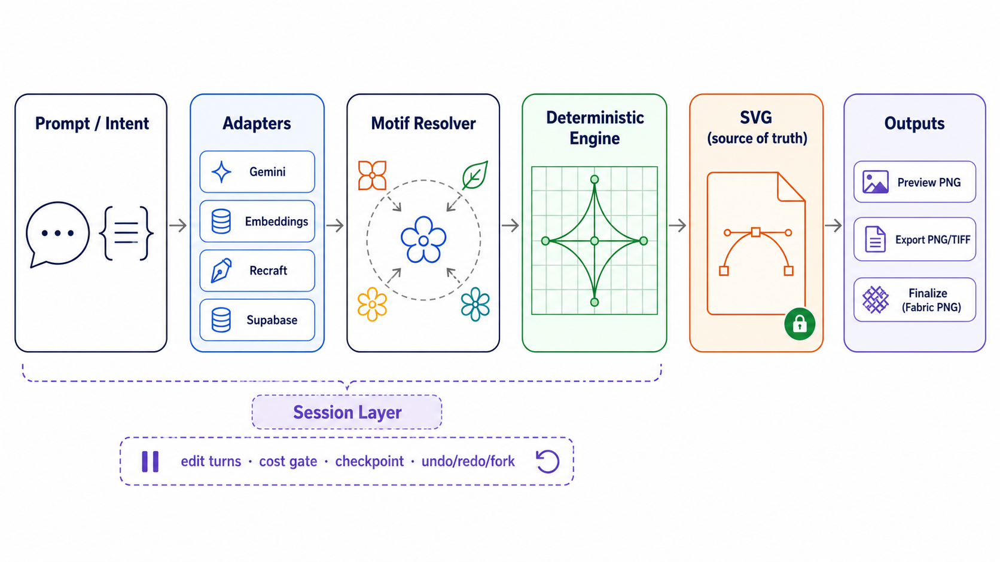
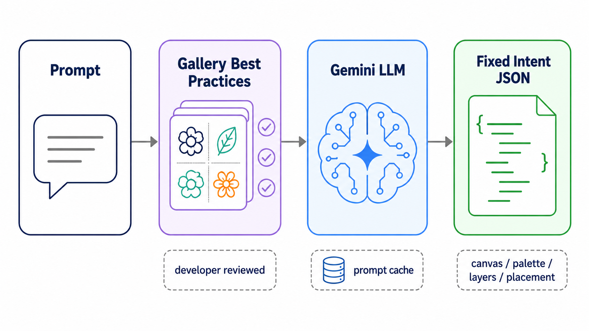
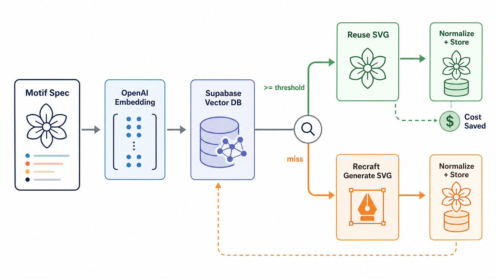
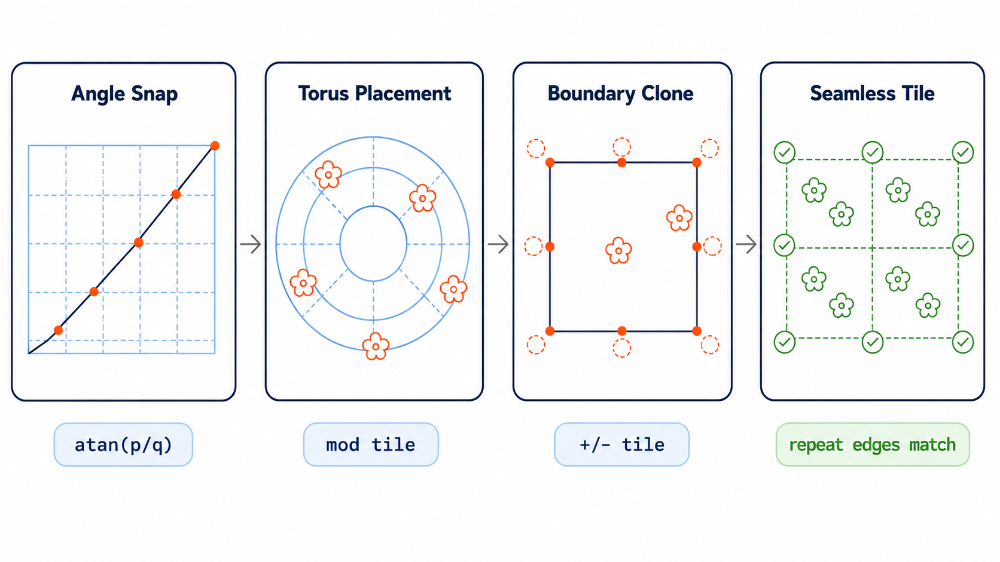
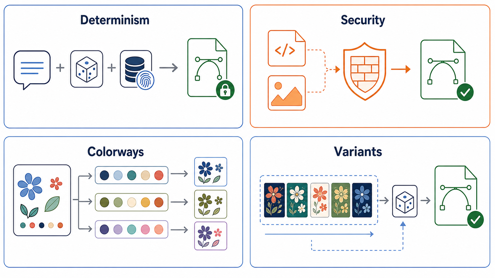

# Seamless Tile

AI 기반 seamless textile SVG 생성 엔진입니다. 자연어 prompt를 고정된 `intent JSON` 계약으로 변환하고,
이후의 좌표, 반복, 배치, 합성, seamless 보장은 deterministic Python engine이 맡습니다.



## 프로젝트 소개

`seamless-tile`은 LLM이 최종 이미지를 직접 그리는 프로젝트가 아닙니다. LLM은 요구사항을 구조화된
intent로 바꾸는 authoring layer에 머물고, 실제 SVG 생성은 재현 가능한 vector pipeline이 닫습니다.

핵심 질문은 하나입니다.

> 생성형 AI를 어디까지 믿고, 어디서부터 소프트웨어 엔진이 보장할 것인가?

이 프로젝트는 그 경계를 `prompt analysis -> intent JSON -> motif resolution -> deterministic engine`으로
명확히 나눕니다.

## 전체 아키텍처

위 도식처럼 입력은 prompt 또는 내부 intent JSON입니다. 외부 AI/API는 engine 바깥 adapter boundary에 있고,
engine은 concrete motif ID가 확정된 resolved intent만 입력받습니다.

- **Adapter Boundary**: Gemini, OpenAI embedding, Recraft, reference image seam.
- **Motif Resolver**: 필요한 SVG motif를 기존 pool에서 찾거나 새로 생성.
- **Deterministic Engine**: validation, candidate, placement, composition, seamless 처리.
- **Output Boundary**: SVG source of truth, Supabase preview/log, PNG/TIFF export.

상세 설계는 [ARCHITECTURE.md](ARCHITECTURE.md)를 기준으로 합니다.

## 1. Prompt -> Intent JSON



Prompt 분석에는 Gemini LLM을 사용합니다. 다만 LLM이 자유롭게 아무 JSON이나 만들게 두지 않고,
프로젝트가 요구하는 고정된 `intent JSON` 형태로 수렴하도록 설계했습니다.

- `gallery/`의 best-practice 예시는 개발자가 직접 검수한 결과물입니다.
- Prompt builder는 이 gallery 구조를 참고해 좋은 패턴 작성 방식을 LLM에 주입합니다.
- 이 단계의 목표는 byte 재현이 아니라 schema 수렴입니다. 채팅 표면에서는 같은 prompt를 다시 보내도
  (sampling temperature>0로) 매번 새로 작성해 다른 디자인을 탐색합니다 — 같은 입력에 바이트 동일 응답을
  주지 않습니다. 정확한 재현은 직접 `intent`를 넣는 경로와 결정론 엔진이 보장합니다(아래 섹션 참고).
- 이 단계의 산출물은 SVG가 아니라 `canvas`, `palette`, `colorways`, `layers`, `placement`를 가진 intent입니다.

즉, LLM은 “그림 생성기”가 아니라 “정해진 schema에 맞춰 textile pattern 의도를 작성하는 parser/author”로
사용합니다.

## 2. Motif SVG 해석과 재사용



Intent가 만들어진 뒤, motif layer에 필요한 SVG를 확정합니다. 이때 매번 Recraft 같은 고비용 생성 API를
호출하지 않도록, Supabase의 vector DB와 OpenAI embedding model로 재사용 가능한 motif를 먼저 찾습니다.

흐름은 다음과 같습니다.

1. LLM이 만든 motif spec을 embedding합니다.
2. Supabase에 저장된 기존 motif record를 facet/filter와 vector similarity로 조회합니다.
3. 설계된 임계치 이상으로 유사한 SVG가 있으면 기존 SVG를 재사용합니다.
4. miss일 때만 Recraft API로 새 SVG motif를 생성하고, normalize 후 다시 저장합니다.

이 구조는 완전한 RAG는 아닙니다. vector DB에서 검색한 데이터를 다시 LLM에 grounding해 답변을 생성하는
형태가 아니기 때문입니다. 대신 **semantic cache + vector reuse**에 가깝습니다. 비용이 큰 motif 생성
호출을 줄이고, 이미 검증된 SVG 자산을 deterministic engine에 다시 투입하려는 것입니다.

## 3. Seamless를 보장하는 방식



Seamless는 사후 pixel 보정으로 맞추지 않습니다. 엔진은 처음부터 반복 가능한 좌표계 위에서 SVG를 만듭니다.

- **Angle snap**: 임의 각도를 tile 경계에서 닫히는 유리 기울기 `atan(p/q)`로 snap합니다.
- **Torus placement**: motif 위치를 tile modulo 좌표계에서 계산해 오른쪽/왼쪽, 위/아래 경계가 이어지게 합니다.
- **Spacing closure**: path-following 간격은 tile 한 변이 아니라 lane closure length를 기준으로 맞춥니다.
- **Boundary clone**: motif가 경계를 넘으면 같은 `<symbol>`을 참조하는 shifted `<use>` clone을 추가합니다.

그래서 seamless는 렌더링 후 검사로 억지 보정하는 것이 아닙니다. 수학적으로 닫히는 반복 구조를 먼저 만든 뒤,
raster seam metric은 회귀 가드로만 사용합니다.

## 내부 엔진 구조

resolved intent가 들어온 뒤 SVG가 나올 때까지의 결정론 파이프라인입니다.

```text
Resolved Intent JSON
  -> Validation Engine
  -> Candidate Engine
  -> Placement Engine
  -> Composition Engine
  -> Seamless Engine
  -> Byte-stable SVG
```

- **Validation Engine**: pydantic 구조 검증, 시맨틱 검증, 제한적 deterministic repair.
- **Candidate Engine**: layout, colorway, seed 축으로 후보 생성, stable ranking/de-dup.
- **Placement Engine**: `lattice`, `point_set`, `path_following`, `scatter` 전략으로 instance 좌표 계산.
- **Composition Engine**: layer를 안정 정렬하고 `<pattern>`, `<symbol>`, `<use>` 기반 SVG로 합성.
- **Seamless Engine**: commensurability와 boundary clone으로 tile edge 연속성 보장.

## 심화 설계 포인트



### 결정론 seal과 registry fingerprint

이 프로젝트의 재현 단위는 단순히 `(prompt, seed)`가 아닙니다. reusable motif pool이 커지면
`stable_hash(variant_group:seed) % len(pool)`로 고르는 variant가 달라지기 때문입니다.

그래서 generate 시점에 reusable pool의 motif ID 목록을 fingerprint하고, `registry_version`에
`+pool.<hex8>` suffix를 스탬프합니다. "같은 입력이면 같은 SVG" 계약은 **resolved intent→SVG** 구간에
해당합니다 — `(intent, seed, colorway, registry_version)`이 같으면 바이트 동일 SVG이고, pool이 바뀌면
version도 같이 움직여 mutable DB state까지 닫습니다. 반면 **prompt→intent** 구간은 채팅 표면에서 일부러
재현하지 않습니다(매 turn LLM이 새로 작성). prompt 단위의 정확한 재현이 필요하면 직접 `intent` 경로를
쓰거나 `GENERATE_CACHE_SIZE`를 켜십시오(repro/debug).

### 신뢰할 수 없는 SVG/이미지 입력 경계

SVG와 image는 공격 표면이 넓어, engine/output 경계에서 fail-closed로 처리합니다.

- SVG parse는 `defusedxml`로 DTD/entity 계열 공격을 막습니다.
- `sanitize_svg`는 engine output을 allowlist로 검증하고, `scrub_svg`는 export로 들어온 untrusted SVG를
  재직렬화합니다.
- external href, `javascript:` URL, 외부 paint server, embedded raster 같은 입력은 거부합니다.
- reference image는 URL fetch 없이 local decode만 수행하므로 SSRF는 경로 밖입니다.
- image upload는 format allowlist, encoded/decoded size cap, pixel cap, integrity check, metadata strip을 거칩니다.

### Multicolor, color slot, colorway 모델

Layer는 raw hex를 직접 들고 다니지 않고 color slot ID만 참조합니다. 실제 출력 색은 활성 colorway의
mapping을 거쳐 마지막 composition 단계에서 해석됩니다.

Recraft나 외부 SVG에서 들어온 multicolor motif도 그대로 색을 굽지 않습니다. motif-local color slot으로
정규화하고, `MotifParams.colors`가 모든 local slot을 palette slot에 바인딩해야 합니다. Recraft 출력은 설정된
color slot cap 안으로 제한/병합되어, production 제약과 colorway 변경 가능성을 함께 유지합니다.

### Variant sampling

다양성은 random으로 만들지 않습니다. motif variant는 `variant_group`으로 묶이고, 선택은
`variant_group + seed`의 순수 함수입니다. pool은 ID 기준으로 안정 정렬되므로 store 반환 순서가 달라도 같은
seed는 같은 variant를 고릅니다. 이렇게 후보 다양성을 만들면서도 결정론 계약을 깨지 않습니다.

## 시스템·운영 설계

엔진 외곽에서 비용·안정성·재현성을 받치는 결정들입니다.

- **Generate 응답 캐시 (in-process LRU, 기본 off)**: 채팅 표면에서 "같은 입력→바이트 동일"을 막기 위해
  기본 비활성(`GENERATE_CACHE_SIZE=0`)입니다. 켜면 cache key는 단순 prompt가 아니라 `request body +
  reusable pool fingerprint`이고, 동일 요청은 adapter/엔진/렌더+업로드를 통째로 건너뛰고 직전 candidates와
  preview URL을 그대로 반환합니다 — 결정론/repro 디버깅용 opt-in입니다.
- **Resource ceiling (DoS 가드)**: 단일 intent가 만들 수 있는 작업/출력에 상한을 둡니다 — placement instance
  수, 합성 SVG byte, raster DPI/tile_mm cap. 신뢰할 수 없는 입력이 자원을 무한히 끌어쓰지 못하게 막습니다.
- **Graceful degradation**: 외부 의존성은 옵션입니다. `SUPABASE_DB_URL`이 없으면 motif persistence와
  generation logging은 in-memory/no-op으로, storage 미설정이면 `png_url`은 `null` + warning으로 떨어집니다.
  embedding이 **미설정**(키 없음)이면 soft-similarity 없이 graceful하게 동작합니다. 단 embedding **호출
  실패**(OpenAI 다운)는 임의 motif 재사용으로 품질을 숨기지 않고 `502`로 끝냅니다. 로컬·테스트는 외부
  credential 없이 그대로 동작합니다.
- **Observability**: `X-Request-ID`가 헤더·응답 body·모든 로그 라인으로 end-to-end 전파되고, 요청당 stage
  latency와 candidate/seam 카운터를 담은 구조화 metrics 한 줄을 남깁니다. 외부 backend 없이 stdlib logging만
  사용합니다.

## 기술 스택

| 영역 | 사용 기술 |
|---|---|
| API | Python, FastAPI, Pydantic |
| LLM/AI | Gemini prompt analysis, OpenAI embedding model, Recraft vector generation |
| Engine | deterministic pipeline, seeded RNG, canonical JSON hashing, registry pool fingerprint |
| Color model | palette slots, colorways, multicolor motif slot binding |
| Vector output | SVG `<pattern>`, `<symbol>`, `<use>`, defusedxml sanitize/scrub boundary |
| Persistence | Supabase Postgres, vector search, motif pool fingerprinting, psycopg |
| Storage/logging | Supabase Storage preview PNG, `seamless_generation_logs` |
| Caching | in-process LRU on `request body + pool fingerprint` |
| Hardening | resource ceiling (placement/SVG byte/DPI cap), graceful degradation |
| Observability | request-id 전파, stdlib 구조화 metrics |
| Quality | pytest, determinism tests, seam regression metrics |

## 현재 상태

1차 개발 기준으로 prompt/intent 기반 generate, motif resolver, deterministic SVG composition, preview upload,
generation logging, export boundary는 구현되어 있습니다. `reference_image` 입력 경로는 upload hardening,
palette extraction, VLM/vectorizer seam까지 갖췄지만, 제품 수준의 image-to-structure/vectorization은 아직
partial feature입니다.

## 주요 코드 위치

- `app/api/routes/generate.py`: product generate route, slim response, preview/logging boundary.
- `app/adapters/llm.py`: Gemini 기반 prompt -> intent authoring.
- `app/adapters/motif_resolver.py`: motif reuse/generation orchestration.
- `app/adapters/registry_fingerprint.py`: reusable pool fingerprint 기반 `registry_version` seal.
- `app/engine/`: candidate, placement, composition, seamless engine.
- `app/engine/palette.py`: color slot과 colorway 해석 모델.
- `app/engine/determinism.py`: stable hash, seeded RNG, variant sampling.
- `app/motifs/`: motif registry, SVG intake normalization, store contract.
- `app/render/`: SVG sanitize/scrub, raster export.
